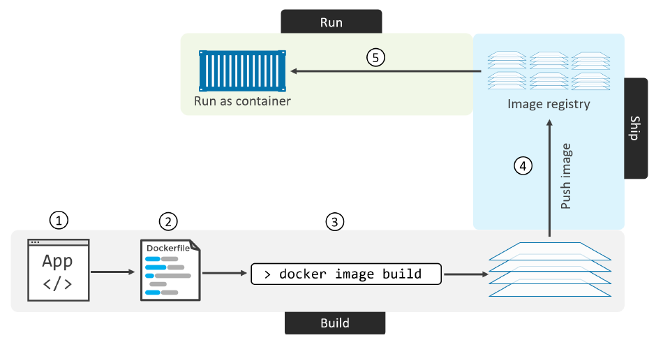

# Containerizing an app

## Containerizing an app - TLDR

1. Start with your application code and dependencies
2. Create a Dockerfile that describes your app, its dependencies and how to run it
3. Feed the Dockerfile into the ```docker image build``` command
4. Push the new image to a registry
5. Run container from the image



## Containerizing an app - Deep dive

### Single-container app

Example app:

```js
import { createServer } from 'http';

createServer((request, response) => {
  response.writeHead(200, { 'content-type': 'text/html' });
  const responseBody = `
  <!DOCTYPE html>
  <html>
    <head>
      <title>Test</title>
    </head>
    <body>
      <h1>Welcome to this test site</h1>
    </body>
  </html>
  `;
  response.end(responseBody);
}).listen(8080, () => {
  console.log('server running at http://localhost:8080');
});
```

package.json:

```json
{
  "name": "example-app",
  "version": "1.0.0",
  "main": "app.js",
  "type": "module",
  "license": "ISC"
}
```

Dockerfile:

```dockerfile
FROM alpine
RUN apk add --update nodejs npm
COPY . /src
WORKDIR /src
EXPOSE 8080
ENTRYPOINT [ "node", "./app.js" ]
```

Dockerfiles are a great source of documentation, since it acurately describes the application and its dependencies.
All Dockerfiles start with the ```FROM <image>``` instruction which will be the base layer/image of our container.
The rest of the app will be added on top as additional layers.
The ```RUN <command>``` instruction will execute any commands in a new layer on top of the current image and commit the result.
The ```COPY <src> <dest>``` instruction copies new files or directories from ```<src>``` and adds them to the filesystem of the container at the path ```<dest>```
With the ```EXPOSE <port>``` command we expose the port our server will be listening on.
Finally the ```ENTRYPOINT``` instruction is used to set the main application that the container should run.
This is added as metadata and not an image layer.

Let's now build the image:

```
$ docker image build -t web:latest .
[+] Building 0.3s (9/9) FINISHED
 => [internal] load build definition from Dockerfile                                                                             0.1s
 => => transferring dockerfile: 31B                                                                                              0.0s
 => [internal] load .dockerignore                                                                                                0.1s
 => => transferring context: 2B                                                                                                  0.0s
 => [internal] load metadata for docker.io/library/alpine:latest                                                                 0.0s
 => [1/4] FROM docker.io/library/alpine                                                                                          0.0s
 => [internal] load build context                                                                                                0.0s
 => => transferring context: 88B                                                                                                 0.0s
 => CACHED [2/4] RUN apk add --update nodejs npm                                                                                 0.0s
 => CACHED [3/4] COPY . /src                                                                                                     0.0s
 => CACHED [4/4] WORKDIR /src                                                                                                    0.0s
 => exporting to image                                                                                                           0.0s
 => => exporting layers                                                                                                          0.0s
 => => writing image sha256:db4320420ab8982380c5906b6eea592dd86e2721b71654c553407de00b3cd195                                     0.0s
 => => naming to docker.io/library/web:latest

$ docker image ls
REPO   TAG       IMAGE ID      CREATED          SIZE
web    latest    db4320420ab8   2 minutes ago   59.2MB

$ docker image inspect web:latest
[
    {
        "Id": "sha256:db4320420ab8982380c5906b6eea592dd86e2721b71654c553407de00b3cd195",
        "RepoTags": [
            "web:latest"
        ],
        "RepoDigests": [],
        "Parent": "",
        "Comment": "buildkit.dockerfile.v0",
        "Created": "2022-11-19T20:50:22.614668426Z",
        "Container": "",
        "ContainerConfig": {
            "Hostname": "",
            "Domainname": "",
            "User": "",
            "AttachStdin": false,
            "AttachStdout": false,
            "AttachStderr": false,
            "Tty": false,
            "OpenStdin": false,
            "StdinOnce": false,
            "Env": null,
            "Cmd": null,
            "Image": "",
            "Volumes": null,
            "WorkingDir": "",
            "Entrypoint": null,
            "OnBuild": null,
            "Labels": null
        },
        "DockerVersion": "",
        "Author": "",
        "Config": {
            "Hostname": "",
            "Domainname": "",
            "User": "",
            "AttachStdin": false,
            "AttachStdout": false,
            "AttachStderr": false,
            "ExposedPorts": {
                "8080/tcp": {}
            },
            "Tty": false,
            "OpenStdin": false,
            "StdinOnce": false,
            "Env": [
                "PATH=/usr/local/sbin:/usr/local/bin:/usr/sbin:/usr/bin:/sbin:/bin"
            ],
            "Cmd": null,
            "Image": "",
            "Volumes": null,
            "WorkingDir": "/src",
            "Entrypoint": [
                "node",
                "./app.js"
            ],
            "OnBuild": null,
            "Labels": null
        },
        "Architecture": "amd64",
        "Os": "linux",
        "Size": 59216943,
        "VirtualSize": 59216943,
        "GraphDriver": {
            "Data": {
                "LowerDir": "/var/lib/docker/overlay2/javz33qgv7201zhtcmzsum7tj/diff:/var/lib/docker/overlay2/rt8ye2ex963d3er9vlrp8qhd1/diff:/var/lib/docker/overlay2/6c9baaa0b14c73bac0f8d9d00f2af048c1f73cefc5b87c391b98e9ba06d154db/diff",
                "MergedDir": "/var/lib/docker/overlay2/vp6pg6kdj4laj2rz5hnm9g869/merged",
                "UpperDir": "/var/lib/docker/overlay2/vp6pg6kdj4laj2rz5hnm9g869/diff",
                "WorkDir": "/var/lib/docker/overlay2/vp6pg6kdj4laj2rz5hnm9g869/work"
            },
            "Name": "overlay2"
        },
        "RootFS": {
            "Type": "layers",
            "Layers": [
                "sha256:e5e13b0c77cbb769548077189c3da2f0a764ceca06af49d8d558e759f5c232bd",
                "sha256:b371d0d31e15c539b26182e81bf59ccda366ef7ff8a5f2075d16bae7101aa031",
                "sha256:c4395c9a00ae2e2013fbfd99886d86ee4e06802b9f219a7e23eff6c0d6d22368",
                "sha256:5f70bf18a086007016e948b04aed3b82103a36bea41755b6cddfaf10ace3c6ef"
            ]
        },
        "Metadata": {
            "LastTagTime": "2022-11-19T20:51:34.831211949Z"
        }
    }
]
```

### Pushing images

After building an image let's store it in an image registry.
Docker Hub is the most common public image registry and is the default push location for the ```docker image push``` command.
Let's login to Docker Hub.

```
$ docker login
Login with your Docker ID to push and pull images from Docker Hub. If you don't have a Docker ID, head over to https://hub.docker.com to create one.
Username: leandersteiner
Password:
Login Succeeded
```

**Note:** You should create a personal access token instead of logging in with you account credentials.

We have to tag our image with our username so we can push it into our personal account on docker hub.
If we don't it would try to push it into the ```web``` repository since it is tagged ```web:latest```.

```
$ docker image tag web:latest leandersteiner/web:latest

$ docker image ls
REPOSITORY           TAG      IMAGE ID       CREATED          SIZE
leandersteiner/web   latest   db4320420ab8   13 minutes ago   59.2MB
web                  latest   db4320420ab8   13 minutes ago   59.2MB
```

```
$ docker image push leandersteiner/web:latest
The push refers to repository [docker.io/leandersteiner/web]
5f70bf18a086: Pushed
c4395c9a00ae: Pushed
b371d0d31e15: Pushed
e5e13b0c77cb: Mounted from library/alpine
latest: digest: sha256:5168f814d76bd3e1bc68d8b5239f8121b1d63acbfb19b002f5a2b383db38ffdc size: 1153
```

### Run the app

```
$ docker container run -d --name web-test -p 8080:8080 web:latest
6718d3cef85833b1441c83fb20b464eeeeb057d9f97ad39ccc16a3c608f7000b
```

The ```-d``` flag runs the container in the background(detached) the ```-p``` flag maps port 8080 on the host to port 8080 in the container.
We can now access the app in our browser by navigating to [http://localhost:8080](http://loclahost:8080).

```
$ docker container ls
CONTAINER ID   IMAGE        COMMAND           CREATED         STATUS         PORTS                    NAMES
6718d3cef858   web:latest   "node ./app.js"   3 minutes ago   Up 3 minutes   0.0.0.0:8080->8080/tcp   web-test
```

### Taking a closer look

```
$ docker image history leandersteiner/web:latest
IMAGE          CREATED          CREATED BY                                      SIZE      COMMENT
db4320420ab8   23 minutes ago   ENTRYPOINT ["node" "./app.js"]                  0B        buildkit.dockerfile.v0
<missing>      23 minutes ago   EXPOSE map[8080/tcp:{}]                         0B        buildkit.dockerfile.v0
<missing>      23 minutes ago   WORKDIR /src                                    0B        buildkit.dockerfile.v0
<missing>      23 minutes ago   COPY . /src # buildkit                          682B      buildkit.dockerfile.v0
<missing>      23 minutes ago   RUN /bin/sh -c apk add --update nodejs npm #…   53.7MB    buildkit.dockerfile.v0
<missing>      7 days ago       /bin/sh -c #(nop)  CMD ["/bin/sh"]              0B
<missing>      7 days ago       /bin/sh -c #(nop) ADD file:ceeb6e8632fafc657…   5.54MB
```

Each line corresponds to an instruction in the Dockerfile.
Only three lines create new layers(the ones with a size greater than 0).

### Multi-stage builds

Example Dockerfile:

```
FROM node:latest AS storefront
WORKDIR /usr/src/atsea/app/react-app
COPY react-app .
RUN npm install
RUN npm run build

FROM maven:latest AS appserver
WORKDIR /usr/src/atsea
COPY pom.xml .
RUN mvn -B -f pom.xml -s /usr/share/maven/ref/settings-docker.xml dependency:resolve
COPY . .
RUN mvn -B -s /usr/share/maven/ref/settings-docker.xml package -DskipTests

FROM java:8-jdk-alpine AS production
RUN adduser -Dh /home/gordon gordon
WORKDIR /static
COPY --from=storefront /usr/src/atsea/app/react-app/build/ .
WORKDIR /app
COPY --from=appserver /usr/src/atsea/target/AtSea-0.0.1-SNAPSHOT.jar .
ENTRYPOINT ["java", "-jar", "/app/AtSea-0.0.1-SNAPSHOT.jar"]
CMD ["--spring.profiles.active=postgres"]
```

We have three build stages in this Dockerfile

- Stage 0: ```storefront```
- Stage 1: ```appserver```
- Stage 2: ```production```

### Commands

- ```docker image build```
- ```FROM```
- ```RUN```
- ```COPY```
- ```EXPOSE```
- ```ENTRYPOINT```
- Other Dockerfile instructions: ```LABEL```, ```ENV```, ```HEALTHCHECK```, ```CMD```, and more
