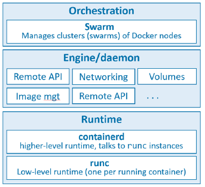
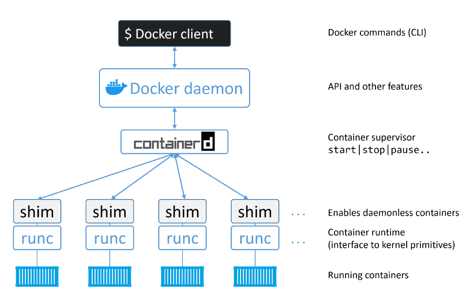
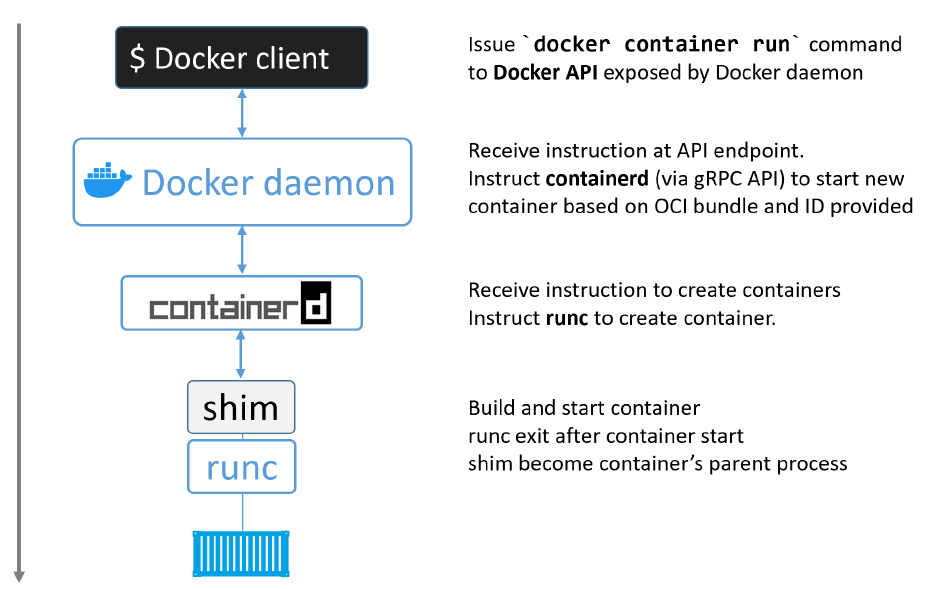

# Docker

## Linux Containers

- Google has contributed many container-related technologies to the linux kernel
- kernel namespaces
- control groups
- union filesystems
- Docker

Containers were very complicated until docker came around.

## Docker Technology

1. The runtime
2. The daemon (a.k.a. engine)
3. The orchestrator



- runtime operates at the lowest level -> responsible for starting and stopping containers (includes building all of the OS constructs such as ```namespaces``` and ```cgroups```)
- low level runtime is called ```runc``` and is the reference implementation of Open Containers Initiative(OCI)
  - every running container on a Docker node has a ```runc``` instance managing it
- higher level runtime is called ```containerd```
  - it does a lot more than ```runc```
  - manages the entire lifecycle of a container
    - pulling images
    - creating network interfaces
    - managing ```runc``` instances
  - used by Docker and Kubernetes as a container runtime
  - typicall Docker installation has a single ```containerd``` process (```docker-containerd```) controlling the ```runc``` (```docker-runc```) instances associated with each running container
- the Docker daemon (```dockerd```) sits above ```containerd``` and performs higher level tasks
  - exposing Docker remote API
  - managing images
  - managing volumes
  - managing networks
  - ...

## Basic Command

```
$ docker version
Client:
 Cloud integration: v1.0.29
 Version:           20.10.21
 API version:       1.41
 Go version:        go1.18.7
 Git commit:        baeda1f
 Built:             Tue Oct 25 18:08:16 2022
 OS/Arch:           windows/amd64
 Context:           default
 Experimental:      true

Server: Docker Desktop 4.14.0 (91374)
 Engine:
  Version:          20.10.21
  API version:      1.41 (minimum version 1.12)
  Go version:       go1.18.7
  Git commit:       3056208
  Built:            Tue Oct 25 18:00:19 2022
  OS/Arch:          linux/amd64
  Experimental:     false
 containerd:
  Version:          1.6.9
  GitCommit:        1c90a442489720eec95342e1789ee8a5e1b9536f
 runc:
  Version:          1.1.4
  GitCommit:        v1.1.4-0-g5fd4c4d
 docker-init:
  Version:          0.19.0
  GitCommit:        de40ad0
```

```
$ docker image ls
REPOSITORY TAG IMAGE ID CREATED SIZE
```

```
$ docker image pull ubuntu:latest
latest: Pulling from library/ubuntu
50aff78429b1: Pull complete
f6d82e297bce: Pull complete
275abb2c8a6f: Pull complete
9f15a39356d6: Pull complete
fc0342a94c89: Pull complete
Digest: sha256:fbaf303...c0ea5d1212
Status: Downloaded newer image for ubuntu:latest
```

```
$ docker images
REPOSITORY TAG IMAGE ID CREATED SIZE
ubuntu latest 1d622ef86b13 16 hours ago 73.9MB
```

```
$ docker container run -it ubuntu:latest bash
root@3ab7094ad550:/#
```

The ```-it``` flag switches your shell into the terminal of the container.

Running ```ps -elf``` inside the new container:

```
root@3ab7094ad550:/# ps -elf
F S UID        PID  PPID  C PRI  NI ADDR SZ WCHAN  STIME TTY          TIME CMD
4 S root         1     0  0  80   0 -  1156 do_wai 15:05 pts/0    00:00:00 bash
0 R root        10     1  0  80   0 -  1764 -      15:07 pts/0    00:00:00 ps -elf
```

We can see that ```bash``` is the only process running inside our container.

```
$ docker container ls
CONTAINER ID   IMAGE           COMMAND   CREATED         STATUS         PORTS     NAMES
3ab7094ad550   ubuntu:latest   "bash"    4 minutes ago   Up 4 minutes             friendly_knuth
```

The output shows a single running container, the one we just created.

We can attach our shell to a container:

```
$ docker container exec -it friendly_knuth bash
root@3ab7094ad550:/#
```

```
$ docker container stop friendly_knuth
friendly_knuth
```

```
$ docker container rm friendly_knuth
friendly_knuth
```

```
$ docker container ls -a
CONTAINER ID   IMAGE     COMMAND   CREATED   STATUS    PORTS     NAMES
```

## Dockerfiles

```Dockerfile
FROM alpine
RUN apk add --update nodejs nodejs-npm
COPY . /src
WORKDIR /src
RUN npm install
EXPOSE 8080
ENTRYPOINT ["node", "./app.js"]
```

Example docker file for a nodejs project.

```
$ docker image build -t test:latest .
Sending build context to Docker daemon 74.75kB
Step 1/8 : FROM alpine
latest: Pulling from library/alpine
88286f41530e: Pull complete
Digest: sha256:f006ecbb824...0c103f4820a417d
Status: Downloaded newer image for alpine:latest
---> 76da55c8019d
<Snip>
Successfully built f154cb3ddbd4
Successfully tagged test:latest
```

```
$ docker image ls
REPO TAG    IMAGE ID     CREATED      SIZE
test latest f154cb3ddbd4 1 minute ago 81.5MB
```

```
$ docker container run -d --name web1 --publish 8080:8080 test:latest
```

## The docker engine

### ```runc```

- reference implementation of the OCI container-runtime-specification
- creates containers
- CLI wrapper for libcontainer (LXC replacement)

### ```containerd```

- docker daemon container execution logic was refactored into a new tool: ```containerd```
- was designed for a single task: container lifecycle management
- taken on more functionality: image pulls, voulmes, networks




### Linux implementaion

On Linux the components are implemented as separate binaries:

- ```dockerd``` (the Docker daemon)
- ```docker-containerd``` (containerd)
- ```docker-containerd-shim``` (shim)
- ```docker-runc``` (runc)
