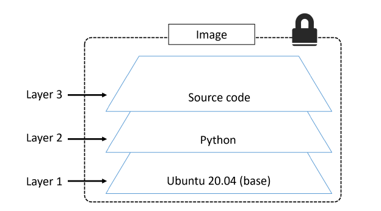

# Docker - Images

## Docker Image - TLDR

- contains everything required to run an application
  - application code
  - application dependencies
  - OS constructs
- similar to VM snapshots
- commonly pulled from a public or private image registry like Docker Hub
- made up of multiple layers stacked on top of each other and represented as a single object
- includes a cut-down operating system
- tend to be small

## Docker Images - Deep Dive

- Images are build-time constructs
- Containers are run-time constructs

We use the ```docker container run``` command to start a container from an image.

### Pulling images

```
$ docker image ls
```

```
$ docker image pull ubuntu:latest
$ docker image pull alpine:latest
$ docker image pull redis:latest
$ docker image pull <repository>:<tag>
$ docker image pull mongo:4.2.6
$ docker image pull alping // will also get the image tagged 'latest'

// pull from unoffical repository
$ docker image pull leandersteiner/microservice-demo:latest

// pull from 3rd pary registry
$ docker image pull gcr.io./google-containers/git-sync:v3.1.5
```

```
$ docker image ls --filter dangling=true
REPOSITORY TAG    IMAGE ID     CREATED    SIZE
<none>     <none> 4fd34165afe0 7 days ago 14.5MB
```

Dangling images appear as ```<none>:<none>``` in listings. This happens commonly when building a new image and giving it a tag that already exists. Docker will remove the tag from the old image and apply it to the newly built one.

Supported filters:

- ```dangling```: Accepts ```true``` or ```false```
- ```before```: Requires image name or id and returns all images created before it
- ```since```: Same as above, but returns images created after
- ```label```: Filters based on presence of a label or label and value

You can also use ```--format``` to format the output using Go templates

```
$ docker image ls --format "{{.Size}}"
5.61MB
98.3MB
1.22MB
```

```
$ docker image ls --format "{{.Repository}}: {{.Tag}}: {{.Size}}"
alpine:  latest: 5.61MB
redis:   latest: 98.3MB
busybox: latest: 1.22MB
```

### Images and Layers

A Docker image is just a bunch of loosely-connected read-only layers, with each layer comprising one or more
files.

```
$ docker image pull ubuntu:latest
latest: Pulling from library/ubuntu
952132ac251a: Pull complete
82659f8f1b76: Pull complete
c19118ca682d: Pull complete
8296858250fe: Pull complete
24e0251a0e2c: Pull complete
Digest: sha256:f4691c96e6bbaa99d...28ae95a60369c506dd6e6f6ab
Status: Downloaded newer image for ubuntu:latest
docker.io/ubuntu:latest
````

```
$ docker image inspect ubuntu:latest
[
  {
    "Id": "sha256:bd3d4369ae.......fa2645f5699037d7d8c6b415a10",
    "RepoTags": [
      "ubuntu:latest"

    <Snip>

    "RootFS": {
      "Type": "layers",
      "Layers": [
        "sha256:c8a75145fc...894129005e461a43875a094b93412",
        "sha256:c6f2b330b6...7214ed6aac305dd03f70b95cdc610",
        "sha256:055757a193...3a9565d78962c7f368d5ac5984998",
        "sha256:4837348061...12695f548406ea77feb5074e195e3",
        "sha256:0cad5e07ba...4bae4cfc66b376265e16c32a0aae9"
      ]
    }
  }
]
```



Multiple images can, and do, share layers. This leads to efficiencies in space and performance.

```
$ docker image pull ...
aad63a933944: Already exists
f229563217f5: Already exists
<Snip>
fc669453c5af: Pull complete
Digest: sha256:674cb03444...f8598e4d2a
```

### Deleting images

```
$ docker image rm 02674b9cb179
Untagged: alpine@sha256:c0537ff6a5218...c0a7726c88e2bb7584dc96
Deleted: sha256:02674b9cb179d57...31ba0abff0c2bf5ceca5bad72cd9
Deleted: sha256:e154057080f4063...2a0d13823bab1be5b86926c6f860
```

```
$ docker image rm f70734b6a266 a4d3716dbb72
```

```
$ docker image pull alpine
Using default tag: latest
latest: Pulling from library/alpine
e110a4a17941: Pull complete
Digest: sha256:3dcdb92d7432d5...3626d99b889d0626de158f73a
Status: Downloaded newer image for alpine:latest

$ docker image pull ubuntu
Using default tag: latest
latest: Pulling from library/ubuntu
952132ac251a: Pull complete
82659f8f1b76: Pull complete
c19118ca682d: Pull complete
8296858250fe: Pull complete
24e0251a0e2c: Pull complete
Digest: sha256:f4691c96e6bba...128ae95a60369c506dd6e6f6ab
Status: Downloaded newer image for ubuntu:latest

$ docker image ls -q
bd3d4369aebc
4e38e38c8ce0

$ docker image rm $(docker image ls -q) -f
Untagged: ubuntu:latest
Untagged: ubuntu@sha256:f4691c9...2128ae95a60369c506dd6e6f6ab
Deleted: sha256:bd3d4369aebc494...fa2645f5699037d7d8c6b415a10
Deleted: sha256:cd10a3b73e247dd...c3a71fcf5b6c2bb28d4f2e5360b
Deleted: sha256:4d4de39110cd250...28bfe816393d0f2e0dae82c363a
Deleted: sha256:6a89826eba8d895...cb0d7dba1ef62409f037c6e608b
Deleted: sha256:33efada9158c32d...195aa12859239d35e7fe9566056
Deleted: sha256:c8a75145fcc4e1a...4129005e461a43875a094b93412
Untagged: alpine:latest
Untagged: alpine@sha256:3dcdb92...313626d99b889d0626de158f73a
Deleted: sha256:4e38e38c8ce0b8d...6225e13b0bfe8cfa2321aec4bba
Deleted: sha256:4fe15f8d0ae69e1...eeeeebb265cd2e328e15c6a869f

$ docker image ls
REPOSITORY TAG IMAGE ID CREATED SIZE
```

### Commands

- ```docker image pull```: download images
- ```docker image ls```: list stored images
- ```docker image inspect```: inspect image, layer data and metadata
- ```docker manifest inspect```: inspect manifest list
- ```docker image rm```: delete image
- ```docker image prune```: remove dangling images
