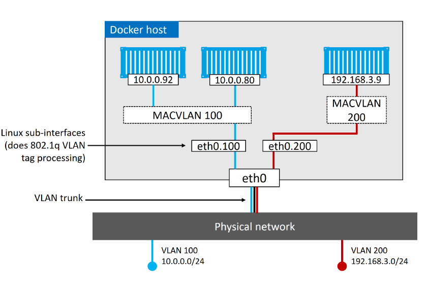

# Docker Networking

- based on the [Container Network Model](https://github.com/moby/libnetwork/blob/master/docs/design.md)(CNM) -> design specification
- ```libnetwork``` is Docker's real-world implementation of the CNM
  - provides all of Docker's core networking capabilities
  - drivers plug-in to ```libnetwork``` to provide specific network topologies
- Docker ships with a set of native drivers
  - single-host bridge networks
  - multi-host overlay
  - and for plugging in to existing VLANs
- ```libnetwork``` also provides native service discovery and load balancing

## Container Network Model(CNM)

three major building blocks:

- Sanboxes: isolated network stack -> includes: Ethernet interfaces, ports, routing tables and DNS config
- Endpoints: virtual network interfaces -> connect sanbox to a network
- Networks: software implementation of a swtich(802.1d bridge)


Container A has a single interface(endpoint) and is connected to Network A. Container B has two interfaces(endpoints) and is connected to Network A and Network B. The two containers can communicate since they are both connected to Network A. The two endpoints in Container B cannot communicate with each other without the assistance of a layer 3 router.

Endpoints can only be connected to a single network.

## Single-host bridge networks

- simplest type of Docker network
- **Single-host**: only exists on a single docker host and can only connect container on the same host
- **Bridge**: implementation of a 802.1d bridge(layer 2 host)
- every Docker host gets a default single-host bridge network
- by default all new containers will be connected to this network unless overriden(```--network```)

```
$ docker network ls
NETWORK ID     NAME      DRIVER    SCOPE
fe21bdcd1066   bridge    bridge    local
```

```
$ docker network inspect bridge
[
    {
        "Name": "bridge",
        "Id": "fe21bdcd1066b93796fa71e4e941e3a249bb5c639d987c5ae4f7e80958056bfc",
        "Created": "2022-11-20T12:04:11.391323208Z",
        "Scope": "local",
        "Driver": "bridge",
        "EnableIPv6": false,
        "IPAM": {
            "Driver": "default",
            "Options": null,
            "Config": [
                {
                    "Subnet": "172.17.0.0/16",
                    "Gateway": "172.17.0.1"
                }
            ]
        },
        "Internal": false,
        "Attachable": false,
        "Ingress": false,
        "ConfigFrom": {
            "Network": ""
        },
        "ConfigOnly": false,
        "Containers": {},
        "Options": {
            "com.docker.network.bridge.default_bridge": "true",
            "com.docker.network.bridge.enable_icc": "true",
            "com.docker.network.bridge.enable_ip_masquerade": "true",
            "com.docker.network.bridge.host_binding_ipv4": "0.0.0.0",
            "com.docker.network.bridge.name": "docker0",
            "com.docker.network.driver.mtu": "1500"
        },
        "Labels": {}
    }
]
```


Let's create a new network:

```
$ docker network create -d bridge localnet
ca5b34792c9f6b71c39c6f4b56d0307171e66ef7474548c89028815e742843cd
```

```
$ docker container run -d --name c1 --network localnet alpine sleep 1d
```

```
$ docker network inspect localnet --format '{{json .Containers}}'
{
  "4edcbd...842c3aa": {
    "Name": "c1",
    "EndpointID": "43a13b...3219b8c13",
    "MacAddress": "02:42:ac:14:00:02",
    "IPv4Address": "172.20.0.2/16",
    "IPv6Address": ""
  }
},
```

## Multi-host overlay networks


The ability to connect containerized apps to external systems and physical networks is vital.
A common example is a partially containerized app - the containerized parts need a way to communicate with the non- containerized parts still running on existing physical networks and VLANs.

Every Container gets its own MAC address and IP addresses.

```
$ docker network create -d macvlan --subnet=10.0.0.0/24 --ip-range=10.0.0.0/25 --gateway=10.0.0.1 -o parent=eth0.100 macvlan100
```


```
$ docker container run -d --name mactainer1 --network macvlan100 alpine sleep 1d
```




## Service discovery

Service discovery allows all containers and Swarm services to locate each other by name. The only requirement
is that they be on the same network.

Under the hood, this leverages Docker’s embedded DNS server and the DNS resolver in each container. Figure
11.19 shows container “c1” pinging container “c2” by name. The same principle applies to Swarm Services.


Process:

1. local DNS resolver resolves name ```c2``` to an IP address
2. no IP found in local cache -> recursive query to Docker DNS server
3. Docker DNS server holds name-to-IP mappings for all containers created with ```--name``` or ```--net-alias```
4. DNS server returns IP if ```c2``` and ```c1``` are on the same network
5. ping command does its job
