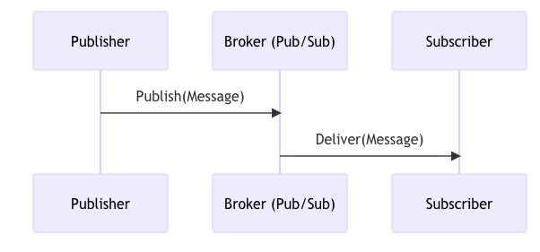

# Go-Event-Driven

## Async

### Goroutines

#### Sync vs Async

- most systems use synchronous communication
  - HTTP with REST APIs
  - gRPC
- client request > server processes it > server responds
- it is simple but application needs to wait for server to complete the request
- problem when you make multiple synchronous requests whitin one action

```go
func SignUp(u User) error {
 if err := CreateUserAccount(u); err != nil {
  return err
 }
 
 if err := AddToNewsletter(u); err != nil {
  return err
 }
 
 if err := SendNotification(u); err != nil {
  return err
 }
 
 return nil
}
```

What happens when one of the calls fails?

- return an error, rollback db changes
- return success to user and ignore errors

We want to add users to the newsletter and send them a welcome email.
But these actions are not critical for the user to sign up and place an order. **We don't need them to happen immediately, but we want them to happen eventually.**

```go
go func() {
 for {
  if err := AddToNewsletter(u); err != nil {
   log.Printf("failed to add user to the newsletter: %v", err)
   time.Sleep(1 * time.Second)
   continue
  }
  break
 }
}()
```

This is a naive approach: restart of service is enough to lose all the retries in progress.

#### Project Async

```go
package worker

import (
  "context"
  "log/slog"
)

type Task int

const (
  TaskIssueReceipt Task = iota
  TaskAppendToTracker
)

type Message struct {
  Task     Task
  TicketID string
}

type Worker struct {
  queue chan Message

  spreadsheetsAPI SpreadsheetsAPI
  receiptsService ReceiptsService
}

type SpreadsheetsAPI interface {
  AppendRow(ctx context.Context, sheetName string, row []string) error
}

type ReceiptsService interface {
  IssueReceipt(ctx context.Context, ticketID string) error
}

func NewWorker(
  spreadsheetsAPI SpreadsheetsAPI,
  receiptsService ReceiptsService,
) *Worker {
  return &Worker{
    queue: make(chan Message, 100),

    spreadsheetsAPI: spreadsheetsAPI,
    receiptsService: receiptsService,
  }
}

func (w *Worker) Send(msgs ...Message) {
  for _, msg := range msgs {
    w.queue <- msg
  }
}


func (w *Worker) Run(ctx context.Context) {
  for msg := range w.queue {
    switch msg.Task {
    case TaskIssueReceipt:
      err := w.receiptsService.IssueReceipt(ctx, msg.TicketID)
      if err != nil {
        slog.With("error", err).Error("failed to issue the receipt")
        w.Send(msg)
      }
    case TaskAppendToTracker:
      err := w.spreadsheetsAPI.AppendRow(ctx, "tickets-to-print", []string{msg.TicketID})
      if err != nil {
        slog.With("error", err).Error("failed to append to tracker")
        w.Send(msg)
      }
    }
  }
}
```

Goroutines are both simple and powerful. They have served us well so far in introducing some asynchronous behaviors.

But they are still a naive solution. **We keep everything in memory, so we can easily lose the messages if the service is restarted.** We also had to implement our own logic for handling errors and retrying.

The next step is choosing a *message broker*, known also as Pub/Sub or queue.



Some of the popular brokers are:

- [Apache Kafka](https://kafka.apache.org/)
- [RabbitMQ](https://www.rabbitmq.com/)
- Cloud Pub/Subs, like [AWS SNS/SQS](https://aws.amazon.com/sns/) or [Google Cloud Pub/Sub](https://cloud.google.com/pubsub)
- [Redis Streams](https://redis.io/docs/latest/develop/data-types/streams/)
- [NATS](https://nats.io/)

Message brokers, just like databases, are critical infrastructure components. You need to consider factors like availability, maintenance, backups, and security. When your messaging infrastructure goes offline, your services won't work properly.

So far, we've dealt with a single subscriber. Redis Streams make this easy because you can pass the topic name and receive any future messages. However, this is far from a production-ready setup.

We'll look at more advanced concepts in the following modules. For now, consider two limitations:

1. We may want to run a second replica of the same application. If we do, both instances receive the same messages, so they are processed twice.
2. If our service goes down, it loses all messages sent before it comes back up. This doesn't need to be a serious outage: A simple restart after deploying a new version is enough to cause this.

A *consumer group* is a concept intended to deal with these issues and decide which subscribers should receive which messages.

Redis remembers the last message delivered to each group. If a subscriber restarts, it will receive the messages sent during the time it was down (unless there were other subscribers in the same group that already processed them).