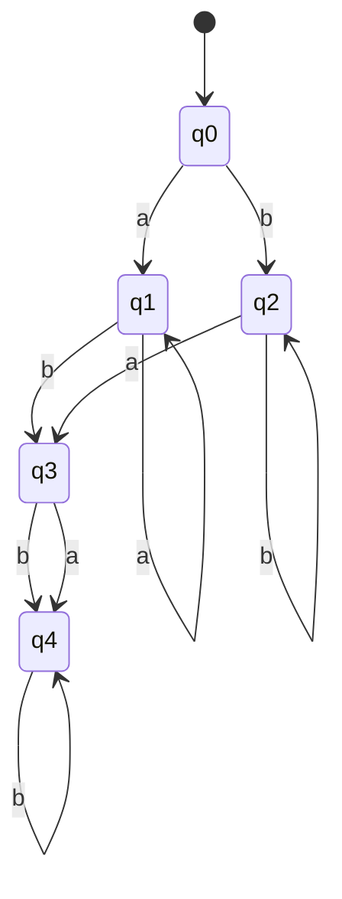

# Formal Languages

## Finite State Machines

- States
- Final States
- Start State (before reading any input)
- Transitions (Arrows)
- Go from state to state reading inputs using states

```mermaid
stateDiagram-v2
    [*] --> q0

    q0 --> q1: a
    q0 --> q2: b

    q1 --> q1: a
    q2 --> q2: b

    q1 --> q3: b
    q2 --> q3: a

    q3 --> q4: b
    q3 --> q4: a

    q4 --> q4: a
    q4 --> q4: b
```
