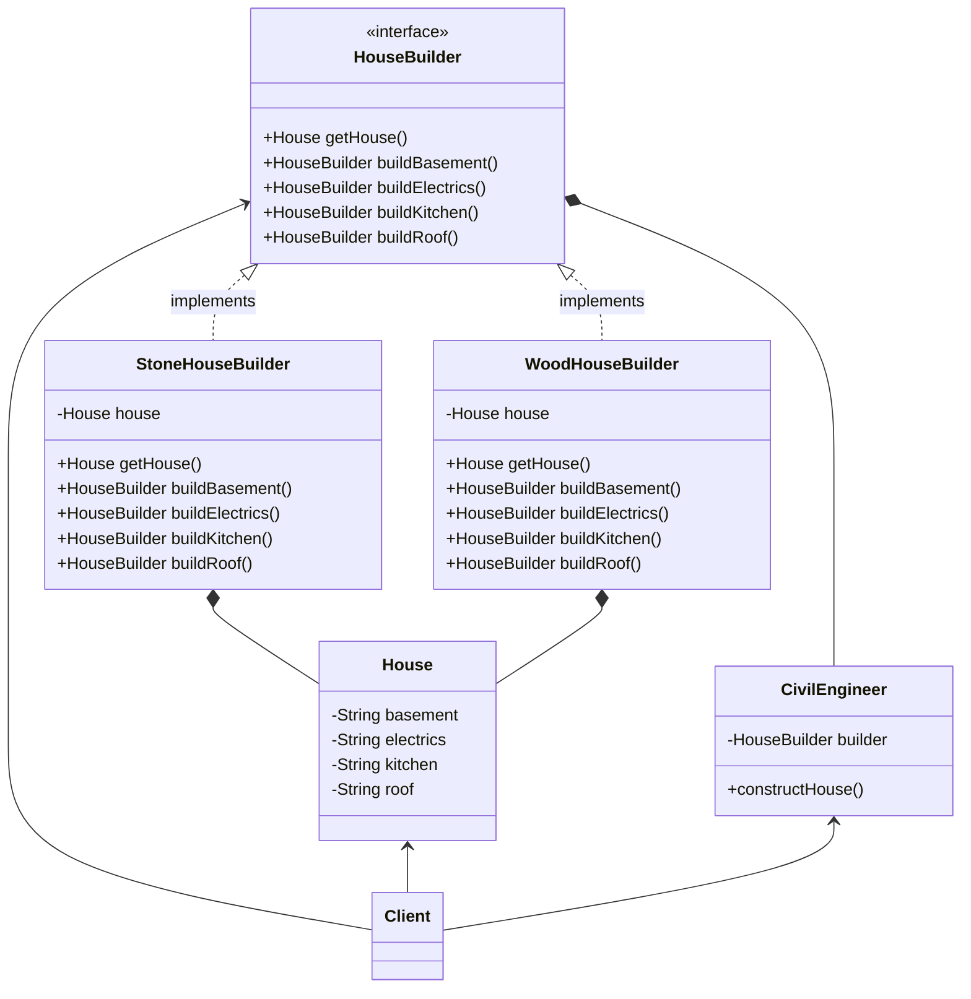

# Builder



CivilEngineer.java

```java
package Builder;

public class CivilEngineer {
    private HouseBuilder builder;

    public CivilEngineer(HouseBuilder builder) {
        this.builder = builder;
    }

    public void constructHouse() {
        builder.buildBasement().buildElectrics().buildKitchen().buildRoof();
    }
}

```

House.java

```java
package Builder;

public class House {
    private String basement; //Keller
    private String electrics; //Elektrik
    private String kitchen; //Küche
    private String roof; //Dach

    public void setBasement(String basement) {
        this.basement = basement;
    }

    public void setElectrics(String electrics) {
        this.electrics = electrics;
    }

    public void setKitchen(String kitchen) {
        this.kitchen = kitchen;
    }

    public void setRoof(String roof) {
        this.roof = roof;
    }

    @Override
    public String toString() {
        return "Basement: " + basement + "\nElectrics: " + electrics + "\nKitchen: " + kitchen + "\nRoof: " + roof;
    }
}
```

HouseBuilder.java

```java
package Builder;

public interface HouseBuilder {
    House getHouse();

    HouseBuilder buildBasement();

    HouseBuilder buildElectrics();

    HouseBuilder buildKitchen();

    HouseBuilder buildRoof();
}
```

StoneHouseBuilder.java

```java
package Builder;

public class StoneHouseBuilder implements HouseBuilder {
    private House house = new House();

    @Override
    public House getHouse() {
        return house;
    }

    @Override
    public HouseBuilder buildBasement() {
        house.setBasement("Basement Stone");
        return this;
    }

    @Override
    public HouseBuilder buildElectrics() {
        house.setElectrics("Electrics Stone");
        return this;
    }

    @Override
    public HouseBuilder buildKitchen() {
        house.setKitchen("Kitchen Stone");
        return this;
    }

    @Override
    public HouseBuilder buildRoof() {
        house.setRoof("Roof Stone");
        return this;
    }
}
```

WoodHouseBuilder.java

```java
package Builder;

public class WoodHouseBuilder implements HouseBuilder {
    private House house = new House();

    @Override
    public House getHouse() {
        return house;
    }

    @Override
    public HouseBuilder buildBasement() {
        house.setBasement("Basement Wood");
        return this;
    }

    @Override
    public HouseBuilder buildElectrics() {
        house.setElectrics("Electrics Wood");
        return this;
    }

    @Override
    public HouseBuilder buildKitchen() {
        house.setKitchen("Kitchen Wood");
        return this;
    }

    @Override
    public HouseBuilder buildRoof() {
        house.setRoof("Roof Wood");
        return this;
    }
}
```

Main.java

```java
package Builder;

public class Main {

    public static void main(String[] args) {
        HouseBuilder builder = new WoodHouseBuilder();
        CivilEngineer engineer = new CivilEngineer(builder);

        engineer.constructHouse();

        House house = builder.getHouse();
        System.out.println(house);

        HouseBuilder builder2 = new StoneHouseBuilder();
        CivilEngineer engineer2 = new CivilEngineer(builder2);

        engineer2.constructHouse();

        House house2 = builder2.getHouse();
        System.out.println(house2);
    }
}
```